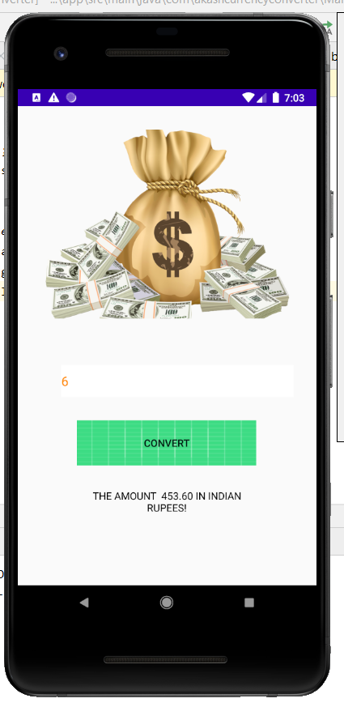

# CurrencyApp
CurrencyApp is a mobile application Which is created in java for converting the different currency in rupees 

<h2> Here is all about this mini Project</h2>

<h1>Java</h1>
<h3>This is backbone of my whole application used some basic harcoded value for dollar to rupees</h3>

<h2>XML</h2>
<h3>I used the simplest and programming language like html i.e exmal for ui/ux.</h3>

Keep Contributing and learning from code...
add some more fuctionality and enjoy codding..

Thank You Guys :)

Happy learning---------------------->

